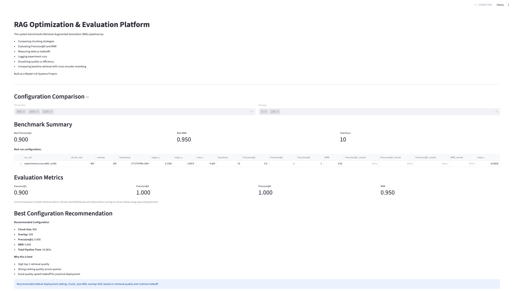

RAG Optimization & Evaluation Platform

A full-stack AI system for benchmarking and optimizing Retrieval-Augmented Generation (RAG) pipelines.

---

Problem

Most RAG systems lack:
- Standardized evaluation metrics  
- Reproducible experimentation  
- Clear performance tradeoff analysis  

This makes it difficult to optimize retrieval quality and deployment efficiency.

---

Solution

This platform enables:

- Configurable chunking strategies (size & overlap)
- Embedding-based retrieval using SentenceTransformers + FAISS
- Retrieval benchmarking using Precision@K and MRR
- Experiment tracking across multiple configurations
- Latency measurement (ingestion, indexing, evaluation)
- Cross-encoder reranking for improved retrieval accuracy
- Interactive dashboard for visualization and analysis

---

System Architecture:

Documents → Ingestion → Chunking → Embedding → FAISS Index
→ Retrieval → Reranking → Evaluation → Dashboard


---

Metrics Implemented

- Precision@1, Precision@3, Precision@5  
- Mean Reciprocal Rank (MRR)  
- Ingestion Time  
- Index Build Time  
- Evaluation Time  

---

Key Results

- Baseline Precision@1: **0.60 – 0.90**
- Reranked Precision@1: **1.00**
- Baseline MRR: **0.78 – 0.95**
- Reranked MRR: **1.00**

Cross-encoder reranking significantly improved top-1 retrieval accuracy and ranking quality.

---

Dashboard

Run locally:

```bash
streamlit run web/dashboard.py

## Features:

- Configuration comparison (chunk size, overlap)
- Retrieval quality vs latency visualization
- Reranking impact analysis
- Best configuration recommendation
- Sample query + grounding / hallucination analysis

## How to Run:

- python app/ingest/ingest.py
- python app/embed/build_index.py
- python -m app.eval.eval_retrieval
- python app/experiments/run_experiment.py

## Project Highlights:

- Built a configurable RAG pipeline using FAISS vector search
- Designed evaluation framework using Precision@K and MRR
- Implemented cross-encoder reranking improving Precision@1 from 0.60 → 1.00
- Developed Streamlit dashboard for experiment visualization
- Added grounding-based hallucination scoring for answer reliability

## Future Work

- LLM-based answer generation with stronger grounding
- Advanced hallucination detection (ML-based)
- Multi-dataset benchmarking
- Cloud deployment (Streamlit Cloud / AWS)

## Dashboard Preview



